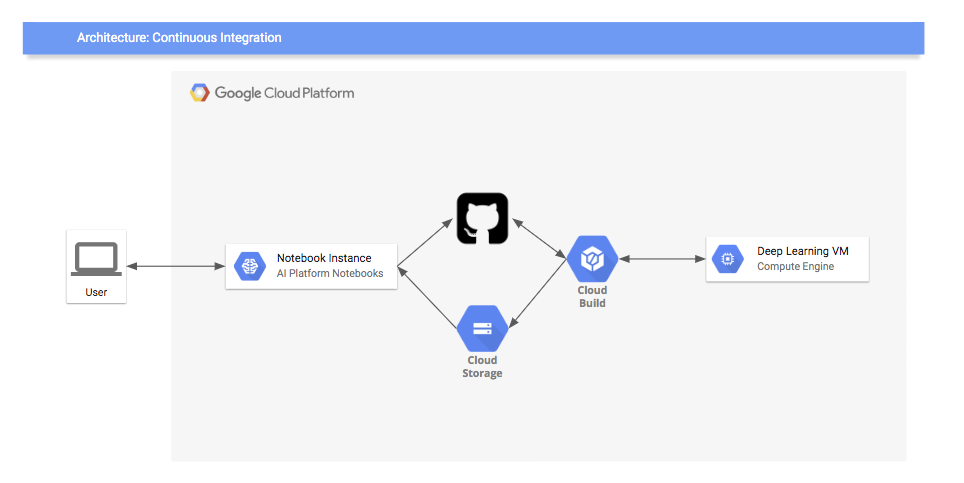
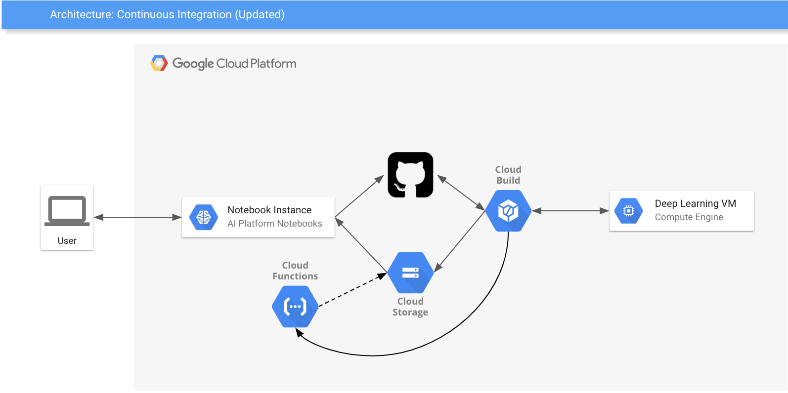
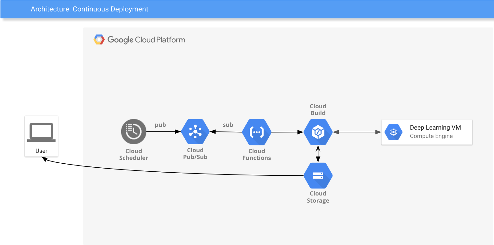

# Fully Configured Example of CI/CD for Notebooks on Top of Google Cloud Platform

This repository includes a fully functional continuous integration and continuous deployment system for [Jupyter Notebooks](https://jupyter.org/). 

The goal of this repository is to showcase what can be built using notebook-centric development practices, and we aim for it to be a reference implementation for those who want to develop similar systems on Google Cloud. For the purposes of this example, we have created the sample notebook [demo.ipynb](demo.ipynb), which takes in a bigquery dataset to generate a usage dashboard, and have set up automated testing and deployment for this notebook. 

Each individual file has been documented with an explanation of its use in the CI+CD system, and we will cover the architecture below.

## GCP Services

In our setup, we have leveraged the following services/products of [Google Cloud Platform](https://cloud.google.com/):

Core services:
* [AI Platform Notebooks](https://cloud.google.com/ml-engine/docs/notebooks/)
* [Cloud Deep Learning VMs (DLVM)](https://cloud.google.com/deep-learning-vm/)
* [Cloud Build](https://cloud.google.com/cloud-build/) 
* [Cloud Storage (GCS)](https://cloud.google.com/storage/)
* GitHub (or [Cloud Source Repository](https://cloud.google.com/source-repositories/))
* [Cloud Functions](https://cloud.google.com/functions/) (CD only)
* [Cloud Pub/Sub](https://cloud.google.com/pubsub/) (CD only)

Extra glue (may vary depending on your setup):
* [Secrets Management](https://cloud.google.com/solutions/secrets-management/)
* [Cloud Scheduler](https://cloud.google.com/scheduler/) (CD only)

# Continuous Integration (CI)

Overview of CI component:



In this flow, a user is developing on an AI Platform Notebook instance. He pushes his notebook with changes to the Github repository, which triggers a git hook and in turn a Cloud Build job ([cloudbuild.yaml](cloudbuild.yaml)). This Cloud Build job creates a testing instance on which the notebook will be executed, and results of the execution will be reported to Cloud Storage for the user to examine. 

Let's follow what happens when a user submits broken code in the notebook.

## Life of a Broken Commit

* User pushes commit that breaks notebook.
* GitHub (or [Cloud Source Repository](https://cloud.google.com/source-repositories/)) has a special pre-configured hook that triggers [Cloud Build](https://cloud.google.com/cloud-build/) each time when a new commit is pushed to master. Cloud Build has provided a guide to set up this git hook [here](https://cloud.google.com/cloud-build/docs/run-builds-with-github-checks).
* [Cloud Build](https://cloud.google.com/cloud-build/) looks for the file [cloudbuild.yaml](cloudbuild.yaml) that describes the testing steps. In our example, this file:
   * clones the repository
   * checkout required commit under test
   * executes testing logic in [run_notebook_instance.sh](run_notebook_instance.sh) which does the following steps:
     * upload notebook (you can upload other files if needed) to GCS
     * use [gcp-notebook-executer](https://blog.kovalevskyi.com/how-to-submit-jupyter-notebook-for-overnight-training-on-gcp-4ce1b0cd4d0d) to start executing the notebook
     * wait until notebook execution is finished
     * check output directory in cloud storage
   * upload tested execution code to GCS and Cloud Functions (used later for CD)
* mark build as green or red

## What do I need to do to create CI for my repository?

1. Make sure that your notebook self-contained and can be executed on top of one of available [Cloud Deep Learning VMs image families](https://cloud.google.com/deep-learning-vm/docs/images)
1. Add [Cloud Build hook to your repository](https://cloud.google.com/cloud-build/docs/run-builds-with-github-checks)
1. Create testing script [run_notebook_instance.sh](run_notebook_instance.sh) based on our script. In the script you need to customize:
    * image family that need to be used
    * VM configuration (GPU type, VM shape, etc)
    * name of the notebook
    * you might need update logic that uploads dependencies to cloud storage
1. Create [cloudbuild.yaml](cloudbuild.yaml) similar to the one from this repository.

# Continuous Deployment (CD)

Overview of CI component (updated):



Overview of CD component:



Now that we have a tested, reproducible notebook, let's automate the execution of the notebook on a set schedule. As the last step of the CI workflow, let's deploy a Cloud Function which runs the same notebook execution code with modifiable parameters ([function code](deploy/main.py)). For orchestration we'll use Cloud Scheduler, but this could be any code/utility/trigger that can publish a message to Pub/Sub (for example, new data arrives in GCS, or a manual request to execute the notebook). Once the schedule is set up, new notebook results will automatically appear in the configured output directory.

## CD Setup 

* Execute an iteration of the CI workflow, if successful this will deploy the Cloud Function and create a Pub/Sub topic ```demo-notebook``` which the function subscribes to.
* Create a Cloud Scheduler job: frequency can be any cron style schedule (e.g. ```0 0 * * 0``` = every sunday midnight), target should be Pub/Sub with the topic ```demo-notebook```, and the payload should be ```{}```, which will use the current date (behavior defined in the [function](deploy/main.py)).

# How to get help

If you have further questions, or encounter issues using AI Platform Notebooks or Deep Learning VMs, reach out at our team's forum: https://groups.google.com/forum/#!forum/google-dl-platform
